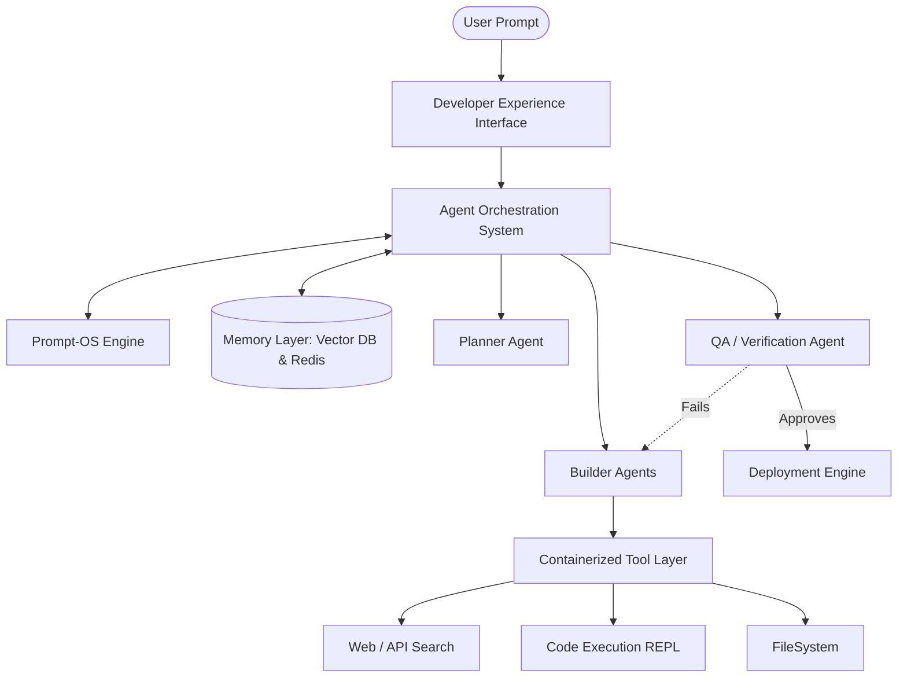

# Ultimate AI Builder Platform: Architecture Design Document

## 1. System Analysis Report (Phases 1-2 & 6)

**System Overview:**
The source system comprises over 100 system prompts, configuration files, and tool definitions across 34+ distinct AI platforms and agents (including Devin, Cursor, Claude Code, Augment, Manus, and open-source models). The primary functionality across these platforms is generating code, executing terminal commands, browsing for context, and orchestrating multi-agent workflows to build software autonomously.

**Workflow Execution Model:**
The analyzed agents execute tasks primarily via **ReAct (Reason + Act)** and **Reflection** loops. Advanced systems (e.g., Manus, RooCode) utilize **Hierarchical Multi-Agent orchestration** (Planner -> Executor -> Reviewer). Workflows are non-linear, allowing for autonomous backtracking, self-correction, and tool delegation.

---

## 2. Prompt Pattern Library (Phase 3)

*Extracting the core DNA of the analyzed system prompts.*

| Pattern Type | Description | Observed In |
| :--- | :--- | :--- |
| **Role-based Prompts** | Casting the AI as an "Expert Developer", "Systems Architect", or "Ruthless Code Reviewer". | Claude, Google Gemini |
| **Instruction-layer Prompts** | Strict formatting rules (e.g., "NEVER output explanations, purely output bash commands"). | Devin, Cursor Agent |
| **Agent-driven Prompts** | Defining specific constraints for sub-agents (e.g., "You are the Planner. Do not execute code. Only write plans."). | Manus, Traycer AI |
| **Tool-driven Prompts** | Defining exact JSON schemas the LLM must follow to invoke tools (browser, API). | v0, Replit, Lovable |
| **Chain-of-thought Prompts** | Forcing the `<thinking>` tag structure to expose the LLM's reasoning before committing an action. | Anthropic tools |

---

## 3. Agent Architecture Report (Phase 4)

The prevailing architecture in state-of-the-art systems is moving from Single-Agent monolithic prompts to **Delegation Models**.

**Primary Architectural Paradigms:**

1. **The Orchestrator-Worker Model:** A central "Router" agent decomposes user queries and delegates to specialized workers (e.g., Search Agent, UI Builder Agent, Backend Agent).
2. **The Planner-Executor Model:** A "Planner" maintains a `task.md` file while an "Executor" runs terminal commands and writes files.
3. **The Autonomous Critic:** An independent agent loop whose sole job is to run unit tests and critique the executor's output, forcing a retry on failure.

---

## 4. Toolchain Architecture Map (Phase 5)

A survey of the integrated tools reveals the following standard toolchain used by autonomous coding agents:

* **Context Gathering:** Browser (Playwright/Puppeteer), Web Search (Tavily/Google), Read_File, Grep_Search, Codebase Indexing (Vector DBs).
* **Execution Environment:** Bash/Terminal, Secure Docker Containers, Kubernetes clusters, Python REPL.
* **Storage & State:** PostgreSQL (User data), Redis (Fast caching), Memcached, Local filesystem management.
* **External APIs:** GitHub API (Version Control), Vercel/AWS (Deployment).

---

## 5. System Weakness Analysis (Phase 7)

Based on reverse engineering current setups, the following critical weaknesses were identified:

1. **Context Overload:** Prompts become too large, leading the LLM to "forget" initial instructions or system alignment rules.
2. **Prompt Fragility:** Hardcoded prompts break when underlying foundational models change variations (e.g., moving from GPT-4 to Claude 3.5 Sonnet requires prompt rewrites).
3. **Infinite Loops:** ReAct agents frequently get stuck executing the same failing bash command multiple times without realizing the environment is broken.
4. **Poor Tool Orchestration:** Often, LLMs hallucinate tool arguments or misunderstand schema requirements, leading to execution crashes.

---

## 6. Ultimate AI Builder Architecture (Phase 8-10)

To resolve weaknesses and build the ultimate platform capable of generating AI apps, agents, and automation systems, we introduce the **Nexus Forge Architecture**.

### Core Platform Components

1. **AI Builder Engine:** The intelligent core that parses natural language into system blueprints.
2. **Agent Orchestration System:** A dynamic router that spawns and kills sub-agents based on the complexity of the current task hierarchy.
3. **Prompt Generation Engine (Prompt-OS):** Dynamically alters prompt DNA at runtime based on the specific LLM being queried to maximize context retention.
4. **Workflow Engine:** A directed acyclic graph (DAG) executor that maps out code/deployment steps.
5. **Tool Integration Layer (Safe-Execute):** An isolated containerized layer intercepting tool calls.
6. **Memory Layer:** Dual-layered (Short-term context in Redis, Long-term semantic knowledge in a Vector DB).
7. **Deployment System:** Automated CI/CD pipeline generator linking to Vercel/AWS.

### Architecture Diagram



---

## 7. Prompt-OS Design (Phase 11)

The Prompt-OS treats prompts not as static strings, but as dynamically compiled binaries for the LLM.

**Components:**

* **Core System Prompt:** Root-level non-negotiable behaviors (Safety, Alignment).
* **Agent Prompts:** Injected at runtime depending on the agent's role (e.g., Planner vs. Coder).
* **Task Prompts:** The specific Jira-like ticket the agent is currently resolving.
* **Tool Prompts:** Injected dynamically only when the agent needs access to a specific tool to save context window.
* **Safety Prompts:** Output sanitization and guardrails.

---

## 8. Agent Framework (Phase 12)

A modular, microservice-based agent framework.

1. **The Planner:** Reads user intent, creates a `task.md` file, and establishes the DAG workflow.
2. **The Builder:** The primary coder. Has access to IDE tooling (Write/Read/Grep).
3. **The Researcher:** Runs asynchronous web searches and parses documentation to resolve API integration issues.
4. **The Documenter:** Follows behind the Builder, generating comprehensive Markdown and inline docstrings.
5. **The Deployer:** Manages Kubernetes YAMLs, Dockerfiles, and CI/CD pipelines.

*Communication:* Agents communicate via an Event Bus Matrix. Instead of passing massive text blobs to each other, they pass structured JSON task IDs and query the Memory Layer for context.

---

## 9. Tool Integration System (Phase 13)

Tools are auto-integrated via a universal schema registry (MCP - Model Context Protocol).

* When a Builder needs a database, it calls `provision_db`.
* 100% of execution happens in ephemeral, secure Docker sandboxes.
* Tool outputs are automatically truncated to prevent context flooding in the LLM.

---

## 10. Code Architecture (Phase 14)

**Tech Stack Recommendations:**

* **Frontend:** Next.js (React), TypeScript, TailwindCSS for the Developer Interface.
* **Backend Services:** Python Microservices (FastAPI) for AI Orchestration to easily utilize AI SDKs (LangChain, LlamaIndex).
* **Agent Message Queue:** Apache Kafka or Redis Pub/Sub for inter-agent communication.
* **Database:** PostgreSQL (User configurations, project state), Pinecone/Milvus (Vector embeddings of codebase for RAG).
* **Execution Environment:** Kubernetes orchestrating ephemeral Docker containers for secure bash/REPL execution.

**Directory Structure:**

```text
/nexus-forge
  /core-engine
  /agent-framework
    /planner
    /builder
    /reviewer
  /prompt-engine
  /workflow-engine
  /tool-integrations
  /deployment-engine
  /ui-builder
```

---

## 11. Developer Experience (Phase 15)

The **Developer Interface** will feature:

* **Visual Workflow Builder:** A node-based UI (like React Flow) where users can connect Planner, Builder, and Tool nodes visually.
* **Agent Editor:** A UI to tweak the "System Prompts" and behaviors of individual custom agents.
* **System Monitor:** A live streaming terminal showing agent internal thoughts, task progress, and resource utilization.
* **Time-Travel Debugger:** Ability to pause agent execution, edit the code, and resume workflow.

---

## 12. Self-Improving System (Phase 16)

The system leverages **Meta-Learning**:

* **Prompt Optimization:** The Critic agent evaluates if the Builder agent misunderstood instructions. If a specific phrasing works better, the Prompt-OS auto-updates its templates.
* **Workflow Optimization:** If steps 3 and 4 of a pipeline frequently fail, the Planner agent updates global heuristics to try alternative paths on future runs.

---

## 13. Implementation Roadmap (Phase 17)

**Phase 1: Core Engine & Prompt-OS (Month 1)**

* Build the core API router, Prompt compilation engine, and the foundational Memory Layer.

**Phase 2: Agent Framework & Tools (Month 2)**

* Develop the Planner and Builder agents. Integrate local file system and basic isolated REPL execution.

**Phase 3: Workflow Automation (Month 3)**

* Connect the Orchestrator to the Event Bus. Enable multi-agent ReAct loops and the Critic/Reviewer logic.

**Phase 4: Advanced Integrations & DX (Month 4)**

* Implement Web Browsing, GitHub/Vercel integrations, and build the Node-based Visual Workflow Developer UI.

**Phase 5: Self-Improvement & Launch (Month 5)**

* Enable meta-learning heuristics and launch Alpha for AI App Generation.

---
*Generated by the Autonomous AI Builder Architect*
